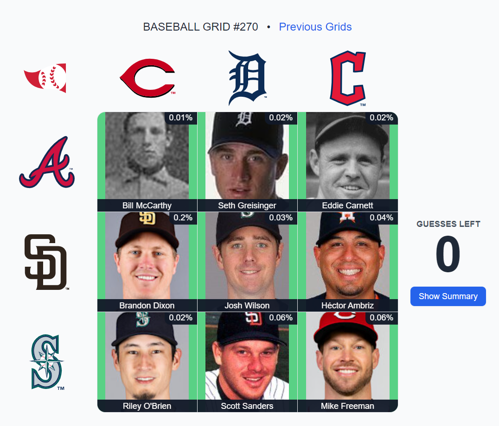
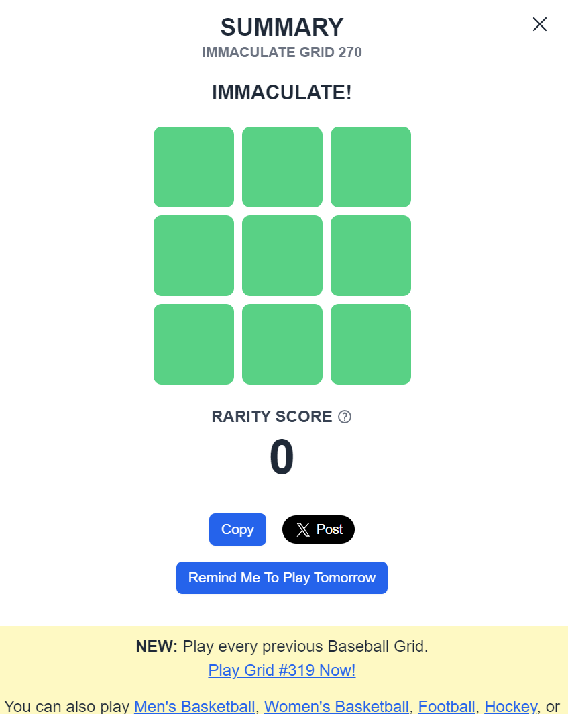

## About
I wanted to write a Python script that could find the best possible answers to the [Immaculate Grid](https://www.immaculategrid.com/) game. Similar to a Sudoku solver, I wrote custom logic to optimize the answers the solver presents. I had to seek out very specific data sources and find work arounds for inconsistent data standards. Currently, the solver is built for team&team questions (i.e. What players played for Seattle and Houston), Cy Young, MVP, Silver Slugger, Gold Glove and Rookie of the Year award winners. The solver has produced the top score and routinely, scores in the top 10 based on rarity of submissions.




## How to Use
```bash
git clone https://github.com/NickRamsey6/ig-solver.git
cd ig-solver
python solve.py
```
Currently the solver works on one column of the grid at a time. You will be prompted to enter the team abbreviation or award for the first column, followed by the team abbreviations (ALL CAPS) for the three rows. The solver will print its suggested answers. Then you can re-run and move on to the next column.

Team Abbreviations
|Team Name | Abbreviation|
|----------|-------------|
|Los Angeles Angels | ANA|
|Arizona Diamondbacks | ARI|
|Atlanta Braves | ATL|
|Baltimore Orioles | BAL|
|Boston Red Sox | BOS|
|Chicago Cubs | CHC|
|Chicago White Sox | CHW|
|Cincinnati Reds | CIN|
|Cleveland Guardians | CLE|
|Colorado Rockies | COL|
|Detroit Tigers | DET|
|Miami Marlins | FLA|
|Houston Astros | HOU|
|Kansas City Royals | KCR|
|Los Angeles Dodgers | LAD|
|Milwaukee Brewers | MIL|
|New York Mets | NYM|
|New York Yankees | NYY|
|Oakland Athletics | OAK|
|Philadelphia Phillies | PHI|
|Pittsburgh Pirates | PIT|
|San Diego Padres | SDP|
|Seattle Mariners | SEA|
|San Francisco Giants | SFG|
|St. Louis Cardinals | STL|
|Tampa Bay Rays | TBD|
|Texas Rangers | TEX|
|Toronto Blue Jays | TOR|
|Washington Nationals | WSN|

Award Abbreviations
|Award Name | Abbreviation|
|-----------|-------------|
|Gold Glove | GG|
|Silver Slugger | SS|
|Cy Young | CY|
|Most Valuable Player | MVP|
|Rookie of the Year | ROTY|
